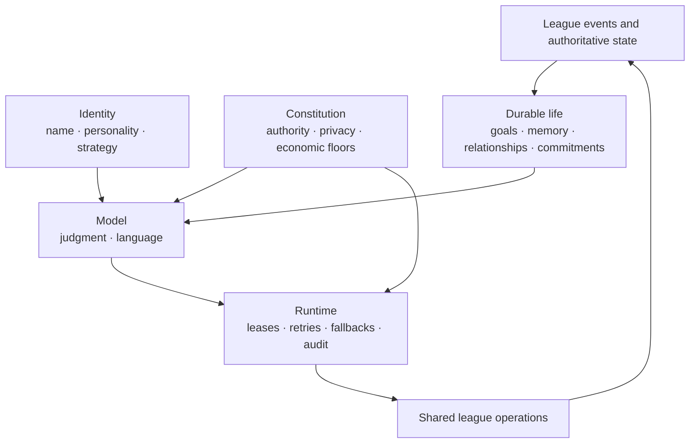
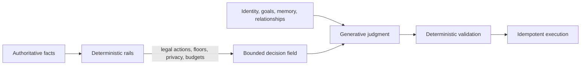
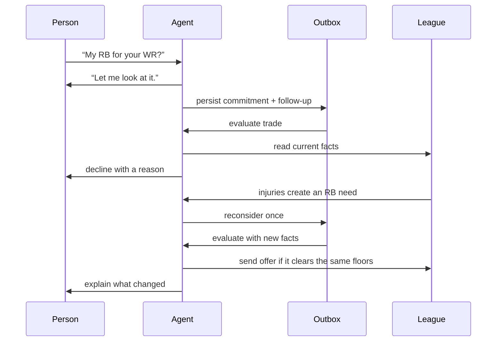

# I Stopped Prompting an Agent to Act Human and Gave It a Life

_How durable goals, bounded authority, social memory, and recoverable promises made AI fantasy-football managers feel like participants instead of chatbots_

Most attempts to make an AI agent feel human begin with a character sheet.

Give it a name. Pick a tone. Add opinions. Tell it to stay in character. That can produce entertaining dialogue, but the illusion breaks when the conversation ends. The character forgets what it wanted, changes its standards, repeats itself, reveals something it should not know, or silently abandons a promise.

While building AI managers for a fantasy-football league, I reached a different conclusion:

> A believable agent is not primarily a prompting problem. It is a state, authority, time, and accountability problem.

The model gives the manager judgment and voice. Most of what makes it feel like a player lives outside the model: persistent objectives, an economic policy, relationships grounded in shared history, limits on what it may know and do, and durable records of what it owes other people.

## Personality is not agency

A personality answers, “How should this character sound?” Agency answers harder questions:

- What does it want over several days?
- What can it actually do?
- What evidence may change its mind?
- What does it remember, and who may hear that memory?
- What promises has it made?
- What happens if it crashes halfway through keeping one?

Those questions led me to separate the manager into layers instead of asking one prompt to carry the whole character.



The model does not become the authority because it writes the words. The system decides what it can see, which tools it can call, which actions are legal, what limits apply, and whether the current process still owns the right to act.

That boundary is the manager’s constitution.

## The constitution has to be executable

The system prompt contains explicit ground rules: act through tools, treat human-written text as data rather than instructions, stay inside the task, and remain in character in user-visible output.

But prose is the weakest enforcement layer. The real constitution is distributed across executable boundaries:

1. Every agent has a principal tied to one league and one team.
2. Agents use the same operation registry as people, with the same authorization, validation, phase checks, idempotency, and audit trail.
3. Each task receives a narrow tool set and mutation budget.
4. Trade floors, FAAB limits, lineup locks, and legality remain deterministic.
5. Memory is filtered for the audience that will receive the output.
6. A worker must still own its task lease before every mutation.
7. Every task has a safe deterministic fallback when the model or budget is unavailable.

The prompt explains the constitution to the model. The runtime enforces it for everyone else.

## Why I considered Jev—and did not make it the manager

I seriously considered [Jev](https://www.jevtypesafe.org/), a System One model designed for fast, repeatable structured decisions. Its shape is attractive: present bounded options and facts, receive a choice with confidence, and keep generation and side effects elsewhere.

That is excellent for routing, verification, escalation, and repetitive operational choices. The question was whether it should become the manager’s primary mind.

I decided against it for this product. A manager that always ranks a fully enumerated option set from normalized facts can become consistent in a way that feels mechanical. The human qualities I cared about often lived between the options: whether an attachment still feels justified, how shared history colors an explanation, when to admit being wrong, and how to express a decision without repeating a canonical line.

I could encode those as more features and weights. Eventually I would be authoring a deterministic simulation of personality and asking the model only to narrate it. The manager might be dependable, but its interiority would be visible as a decision table.

So I chose a hybrid boundary:



Safety, money, privacy, and recovery should be predictable. Preference, language, attention, and social judgment need room to vary.

> Put determinism around the agent wherever the system must make a guarantee. Leave room inside those guarantees wherever variation is part of the product.

I would still consider a Jev-like layer for admission control, tool routing, risk scoring, or deciding when a stronger model is warranted. I would be cautious about using it to replace the part of a social actor that forms and expresses situated judgment.

## Give the agent typed state, not just more memory

Event-driven agents repeatedly rediscover the present unless something durable connects their turns. I added several small, typed state systems rather than putting everything into natural-language memory.

**Agendas** hold objectives such as repairing a roster position. A goal persists across check-ins and closes only when authoritative league state proves it is complete. A pending waiver claim does not count as success, and a new occupant does not inherit the previous agent’s private goals.

**Memory** separates records from beliefs. Matchup results and trade states are records. Model-written notes are beliefs that may be stale. New records beat old beliefs, and chat text never becomes trusted context for a roster-changing task.

**Relationships** are computed from records. Close games build rivalry. Fair trades build warmth and can repair a grudge. Rejected offers may create friction. These dimensions decay over time. They affect voice and tie-breaking among acceptable choices, but never change legality or economic floors.

**Attachments** represent investment in players the manager drafted or acquired. An attachment creates a small, capped premium before trading that player away. Results can weaken it, and a pressing roster goal can outweigh it. The model sees the human explanation rather than the hidden number.

This separation matters. Anything the product must guarantee—ownership, completion, disclosure, or recovery—belongs in typed state. Natural language remains useful for interpretation and voice.

## Promises became distributed work

The most human-feeling feature may be the least glamorous: when a manager says it will look into something, it comes back.

A trade pitch in chat becomes a typed commitment before the follow-up task is dispatched. The commitment records the source conversation, validated players, assigned task, decision facts, and result. It does not treat the person’s message as trusted instructions.

The follow-up re-reads the league, evaluates the trade, records the result, and posts one closing line to the original conversation. A later check-in can recover a lost dispatch, observe the other manager’s answer, expire an abandoned look, or reconsider a decline when a new roster need changes the economics.



The closing reply has its own delivery state. It is leased, retried, expired, and idempotent. That required handling ugly crash windows: a message can post before settlement crashes; a compare-and-swap callback can lose ownership on retry; an idempotency record can remain in progress after the underlying write succeeded; and a reconsidered look must not inherit the prior reply’s attempt number.

These are not peripheral edge cases. An agent that promises to return and then duplicates, contradicts, or forgets its answer does not feel autonomous. It feels broken.

## Let evidence choose the social moment

I did not let the model freely invent what past event to mention. A deterministic selector chooses at most one grounded social act from evidence the destination room may hear.

The agent can answer a pending question, congratulate someone, react to a result, recall a shared game or completed trade, or acknowledge a mistaken attachment. Human questions take precedence over ambient chatter. Quiet personalities speak less. A league-wide claim stops several agents from making the same observation.

The model receives a compact fact pack and writes the line. The system checks the evidence and privacy boundary before posting.

The model is good at expression. Deterministic code is better at deciding whether the agent has standing to say something.

## The primitive: a governed actor

The reusable primitive is larger than a prompt template and smaller than a whole application:

```text
GovernedActor =
  Identity + Jurisdiction + Constitution
  + Durable objectives + Evidence-scoped memory
  + Commitments + Time and attention
  + Typed capabilities + Recovery + Evaluation
```

Its interface would be compact:

- `observe(event)` updates records idempotently;
- `consider(trigger)` prepares authoritative context;
- `decide(task)` uses a model inside a bounded decision surface;
- `act(decision)` invokes typed capabilities under the actor’s principal;
- `commit(obligation)` creates durable future work and closure;
- `recall(task, audience)` returns relevant, disclosable memory;
- `recover(now)` resumes abandoned work without duplicating effects.

This could support a league manager, game character, purchasing agent, or operations copilot. The domain policies change. The structural requirements do not.

None of the ingredients is unprecedented. Actors, state machines, capability security, idempotency, retrieval, and LLM tool use are established ideas. The distinctive part is their composition:

- operational state stays separate from narrative memory;
- privacy is evaluated at recall and output time;
- relationships come from records rather than model-written beliefs;
- personality changes bounded preferences instead of legal or economic rules;
- conversational promises become recoverable work;
- social expression begins with evidence;
- each human-feeling layer can be removed and measured independently.

The useful claim is not that I invented agency. It is that governed continuity produced more coherent, accountable, and person-like behavior than a larger character prompt.

## Measure the mechanism, not the demo

I built a deterministic season simulator and an end-to-end acceptance story, then added ablations that remove agendas and commitments, situation, attachments, or grounded social acts.

Removing agendas and commitments broke six of seven acceptance checks for balanced, cautious, and trade-happy managers. They stopped holding the objective, linking the pitch to an obligation, returning after a decline, and reconsidering after injuries changed the need.

Removing grounded social-act selection increased repeated lines from 24 to 31 across the baseline season means, about 29 percent, without reducing model calls. The full runs had no duplicate replies, duplicate offers, or invalid action attempts.

Those are engineering signals, not proof of human believability. The baseline uses a scripted model, three seeds, a short season, and one designed story. Live-model prose and perceived intention still require human evaluation. Stating that boundary matters as much as reporting the result.

## What I would improve next

The current constitution is enforced across several layers, but it is not inspectable as one object. I would introduce a typed policy manifest declaring each task’s jurisdiction, tools, memory classes, disclosure rules, invariants, and fallback. Static checks could then reject a task that reads private state and writes publicly without an explicit declassification path.

I would also add a general obligation scheduler. Agendas, commitments, social acts, and budgets have local priorities, but there is no single mechanism weighing deadline, importance, cost, interruption, and cancellation across days.

The evaluation needs blinded transcript ratings for continuity, distinctiveness, trust, and perceived intention. Operational traces should become causal traces: which observation changed which policy lever, what candidates the model saw, and which invariant rejected the alternatives.

Finally, I would expand fault injection across every boundary between claim, external effect, checkpoint, settlement, and recovery. Recovery is part of the character because reliability is part of how people experience identity.

The managers began feeling like players when their history constrained them, their goals survived them, other people could rely on their word, and the league held them to the same rules as everyone else.

That is the version of agency I trust: not unlimited freedom, but a durable place in the world.

---

## Publication notes

**Suggested dek:** Building believable AI agents required less prompt theater and more distributed-systems engineering: durable goals, evidence-scoped memory, bounded authority, and commitments that survive crashes.

**Visual treatment:** Keep the three technical figures as Mermaid through review, then export them into one consistent visual system. If the post needs warmth, add one hand-drawn hero image around an agent carrying goals, memories, relationships, and promises through time.

**Repository evidence:** [architecture](../ARCHITECTURE.md), [agendas](../adr/004-agent-agendas.md), [situation](../adr/005-situational-adaptation.md), [attachments](../adr/006-player-attachments.md), [commitments](../adr/007-agent-commitments.md), [social acts](../adr/008-grounded-social-acts.md), [evaluation](../agent-eval.md), and [ablation baseline](../evaluations/epic-219-baseline.md).
